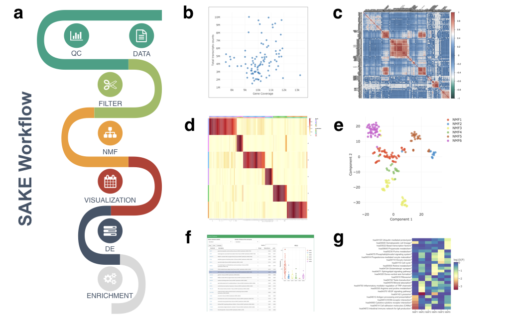

<!-- README.md is generated from README.Rmd. Please edit that file -->
sake
====

[](https://travis-ci.com/naikai/sake) [](https://codecov.io/gh/naikai/sake)

**S**ingle-cell RNA-Seq **A**nalysis and **K**lustering **E**valuation
----------------------------------------------------------------------

The aim of `sake` is to provide a user-friendly tool for easy analysis of NGS Single-Cell transcriptomic data



**Flowchart of SAKE package and example analysis results**: **a)** Analysis workflow for analyzing single-cell RNA-Seq data. **b)** Quality Controls to compare total sequenced reads to total gene transcripts detected. **c)** Sample correlation heat map plot **d)** A heat map of sample assignment from NMF run, with dark red indicating high confidence in cluster assignments **e)** t-SNE plot to compare NMF assigned groups with t-SNE projections. **f)** A table of NMF identified features (genes defining each cluster) and a box plot of gene expression distributions across NMF assigned groups. **g)** Summary table for GO term enrichment analysis for each NMF assigned group.

Installation
------------

First we will install some prerequisite libraries before installing `sake`

For **Centos** (tested on 6.9)

``` bash
sudo yum install openssl-devel libcurl-devel libpng-devel libxml2-devel libxslt

# Require `gcc` >= 4.6 
sudo yum install centos-release-scl
sudo yum install devtoolset-3-toolchain
scl enable devtoolset-3 bash
```

For **Ubuntu** (tested on 16.10)

``` bash
sudo apt-get install libcurl4-openssl-dev libpng-dev libxslt-dev libssl-dev libxml2-dev xsltproc
```

For **Mac OS** (tested on Sierra 10.12.1)

``` bash
# follow instructions to install brew on MAC
http://brew.sh
# install required packages 
brew install curl openssl libpng libxslt libxml2 
# update gcc
brew install gcc48
```

#### Download and [Install R](http://cran.wustl.edu)

-   Download and [Install Rstudio](https://www.rstudio.com/products/rstudio/download/) (Suggested but not required)

#### To install the latest development version from GitHub (around 30 minutes)

``` r
source("http://bioconductor.org/biocLite.R")
biocLite(c("annotate", "AnnotationHub", "biomaRt", "DESeq2", "gage", "gageData", "GO.db", "pathview", "plotly", "DT"))

install.packages("devtools")
devtools::install_github("renozao/pkgmaker", ref="develop")
devtools::install_github("naikai/sake") # You may want to consider "devtools::install_github("naikai/sake", CC=gcc-7) to flag for use with the GCC compiler" 
```

#### Quick update on how to install SAKE. 2023-02-08 (inputs from @savytskanatalia)
``` r
# I reinstalled older versions of the packages: 
# plotly 4.9.2,  htmltools 0.5.0, htmlwidgets 1.5.2, 
# promises 1.1.1, crosstalk 1.1.0.1, and DT 0.16 
remove.packages("plotly")
remove.packages("htmltools")
remove.packages("htmlwidgets")
remove.packages("promises")
remove.packages("crosstalk")
remove.packages("DT")
install.packages("https://cran.r-project.org/src/contrib/Archive/crosstalk/crosstalk_1.1.0.1.tar.gz", repo=NULL, type="source")
install.packages("https://cran.r-project.org/src/contrib/Archive/promises/promises_1.1.1.tar.gz", repo=NULL, type="source")

install.packages("https://cran.r-project.org/src/contrib/Archive/plotly/plotly_4.9.2.tar.gz", repo=NULL, type="source")
install.packages("https://cran.r-project.org/src/contrib/Archive/htmltools/htmltools_0.5.0.tar.gz", repo=NULL, type="source")
install.packages("https://cran.r-project.org/src/contrib/Archive/htmlwidgets/htmlwidgets_1.5.2.tar.gz", repo=NULL, type="source")
install.packages("https://cran.r-project.org/src/contrib/Archive/DT/DT_0.16.tar.gz", repo=NULL, type="source")
# gage_2.36.0

# go even below the versions
# shiny 1.4.0.2
# shinydashboard 0.7.1
# shinythemes 1.1.2

remove.packages("shiny")
remove.packages("shinydashboard")
remove.packages("shinythemes")

install.packages("https://cran.r-project.org/src/contrib/Archive/shiny/shiny_1.4.0.2.tar.gz", repo=NULL, type="source")
install.packages("https://cran.r-project.org/src/contrib/Archive/shinydashboard/shinydashboard_0.7.1.tar.gz", repo=NULL, type="source")
install.packages("https://cran.r-project.org/src/contrib/Archive/shinythemes/shinythemes_1.1.2.tar.gz", repo=NULL, type="source")
```


Usage
-----

``` r
library(sake)
shiny::runApp(system.file("sake", package="sake"))
```

Getting Started
---------------

Please follow the links to briefly walk you through the functions of `sake` package.

-   [Data input](vignettes/Data_Input.Rmd)
-   [Quality control](vignettes/Quality_Control.Rmd)
-   [Filtering](vignettes/Filtering.Rmd)
-   [Run NMF](vignettes/NMF.Rmd)
-   [Visualization](vignettes/Visualization.Rmd)
-   [DE and Enrichment](vignettes/DE_Enrich.Rmd)

-   Example1 - Ting et al [HTML](vignettes/Ting.Rmd) [PDF](vignettes/Ting_pdf.pdf)
-   Example2 - Treutlein et al [HTML](vignettes/Treutlein.Rmd) [PDF](vignettes/Treutlein_pdf.pdf)

Copying & Distribution
----------------------

Please note that this project is released with a [Contributor Code of Conduct](CONDUCT.md). By participating in this project you agree to abide by its terms.

