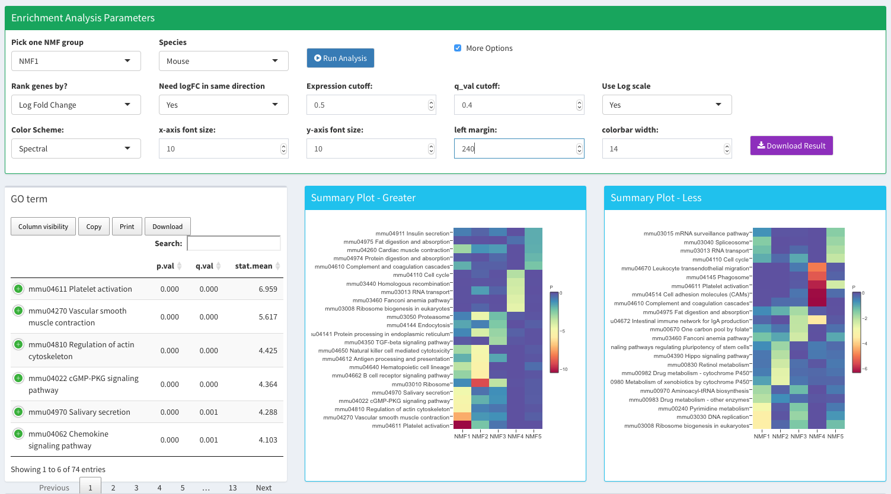

After getting the classification results from running NMF method, users can use DESeq to do differential expression analysis. This way they can assess more markers that are statistically different between groups of interest.  

## Differential Expression Analysis

## Enrichment Analysis 

