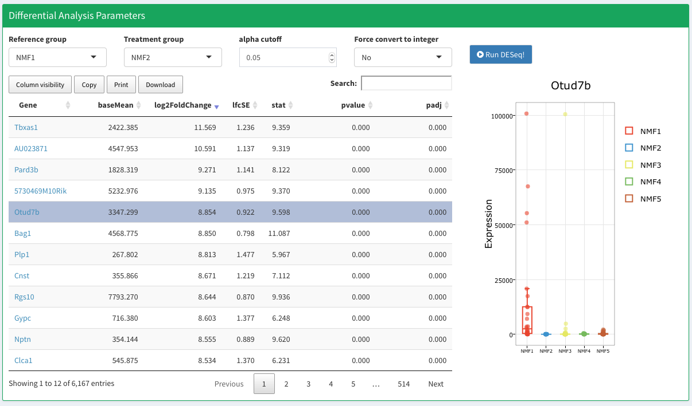
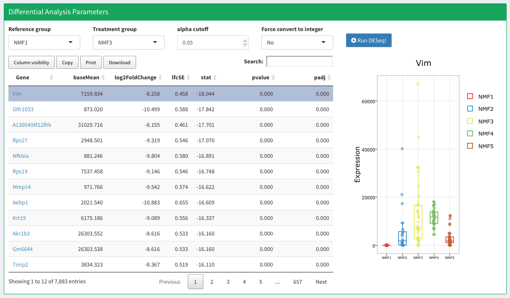
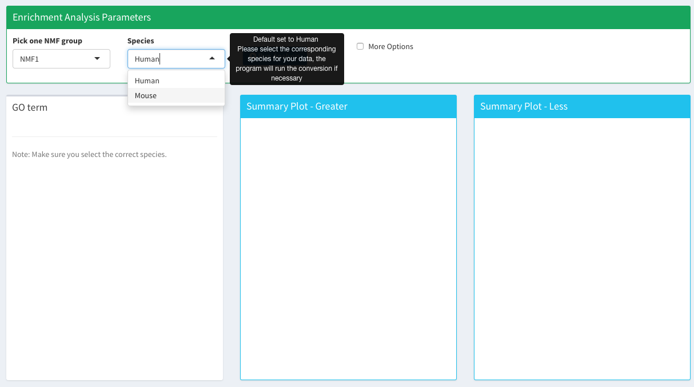
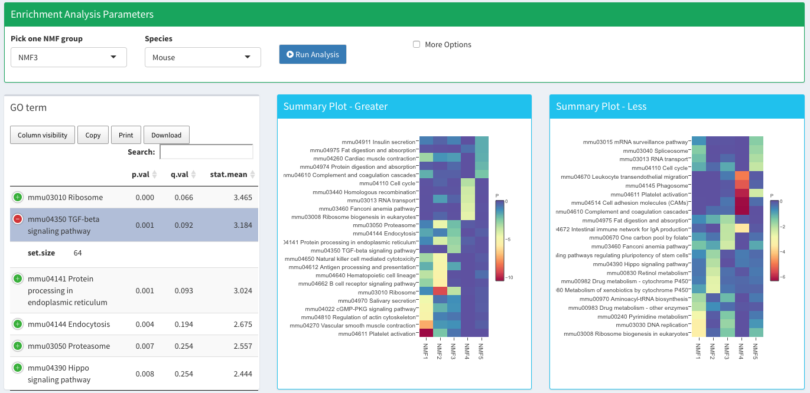
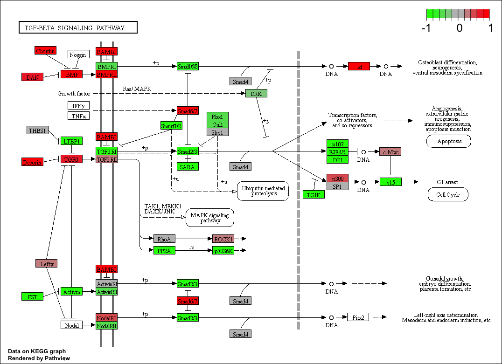

Differential expression (DE) analysis between NMF clusters allows for the identification of additional genes differentially expressed in each NMF cluster with statistical analyses calculated via the [DESeq](http://bioconductor.org/packages/release/bioc/html/DESeq.html) algorithm (Love et al., 2014). Expression distributions for DE genes across NMF groups are displayed together with RefSeq annotation. 

## Differential Expression 

## Enrichment Analysis 

[GO Term enrichments](http://bioconductor.org/packages/devel/bioc/html/gage.html) allow for the identification of functional categories enriched in each NMF cluster, which can serve as guidance for further investigation and follow up studies. 

*Note: Make sure to select the correct species. SAKE currently supports `Human` and `Mouse`.*

Summary table and plots for the enrichment analysis. 

User can also click on one of the enriched KEGG pathways they are interested in. [Pathview](https://bioconductor.org/packages/release/bioc/html/pathview.html) will maps and renders pathway grpahs. In this case, we select `TGF-beta signaling pathway` from `NMF Group3`. Red color indicates genes that are upregulated in selected NMF cluster as compared to all the other clusters. 

