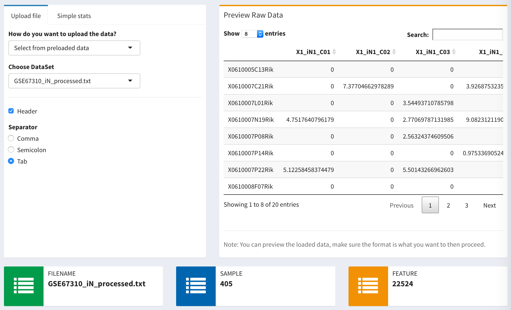

There are three different ways you can upload files into `icash` pacakge. It can either be 

- Rawdata file 
- Preloaded data
- Saved run result

## Rawdata file

The gene count data file is one of the most common types of data format. Each row represents expression value from a gene, and each column represents transcriptome library derived from a single sample. The package requires the first row to be the header, which you can provide information about each sample. The first column is required to be names/ID for each gene/transcript. 

You can also specify the delimiter according to different file type.

- Tab (\\t) - Default setting for `.txt` or `.out` file
- Comma (,) - Usually used by `.csv` file
- Semicolon (;) - Not so common, but some use this type

### Example data sets should look like this: 

```{r, echo=FALSE, message=FALSE, warning=FALSE, results='asis'}
library(icash)
knitr::kable(Usoskin[1:10, 1:8])
```

## Preloaded data

There are several preloaded gene expression data from published single-cell studies that were already been preloaded with the package. They include studies relate to neuronal differentiation^[Treutlein *et al*, Dissecting direct reprogramming from fibroblast to neuron using single-cell RNA-seq, Nature, 2016], identification of cell types within mouse cortex and hippocampus^[Zeisel *et al*, Cell types in the mouse cortex and hippocampus revealed by single-cell RNA-seq, Science, 2015], ecosystem in metastatic melanoma^[Tirosh *et al*, Dissecting the multicellular ecosystem of metastatic melanoma by single-cell RNA-seq, Cell, 2016], and classification of sensory neuron types^[Usoskin *et al*, Unbiased classification of sensory neuron types by large-scale single-cell RNA sequencing, Nature Neuroscience, 2015]. The user can sift through and test each module using these data.

## Saved run result

User has the option to utlize [yabi](https://demo.bsr.tools/yabi/login/?next=/yabi/) to run clustering analysis through its user-friendlly web interface. This is especially useful when the sample sizes of the single-cell study becomes larger and larger. The previous run results can be saved in [.rda](https://stat.ethz.ch/R-manual/R-devel/library/base/html/load.html) format and then loaded back to `icash` package. Once the analysis is done, it will include data analysis of NMF, t-SNE, and DESeq2 (if specified). 

Example saved data can be downloaded [here](https://)

## Loaded Data 

A successfully loaded data will look like this  



***

> "*If you are thinking without writing, you only think your're thinking* - Leslie Lamport"
([via](https://www.youtube.com/watch?v=-4Yp3j_jk8Q))
