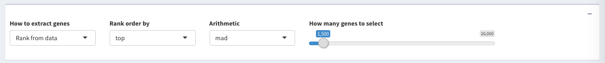

One of the steps we can do before clustering is to filter genes with small variations due to technical or biological noises.  In this tab we also provide preliminary correlation analysis between all samples, a tool to visualize genetic networks in the data, and a scatter plot comparison of genes in two different samples. 

## Filtering

We provide three different methods to filter genes from your dataset before downstream analysis. 

- **Whole transcriptome:** select whole transcriptome if you want to use all the genes present in your data for downstream analysis. 

- **Rank from data\:** you can rank and filter genes based on simple statistics calculated across each gene. There are currently four ways of ranking genes: mean, median, median absolute deviation (MAD), and variance. In our experience, we find using `Median Absolute Deviation (MAD)` often give us accurate and reproducible results. However, you need to specify the number of top genes to be selected. In general, we suggest using Top **1500 - 3000** MAD genes for `bulk RNA-Seq` data; Top **5000 - 8000** MAD genes for `single-cell RNA-Seq` data. 

- **Upload gene list:** You also have the option to upload a text file which contains your gene of interest. This is typically done when you have a list of marker genes for specific hypothesis and want to see how samples cluster accordingly. 

An example gene list file should look like [this](../inst/extdata/genefile/genelist.EMT.txt):

Gene        | 
------------| -------------
AHNAK       |
BMP1        |
CALD1       |
CAMK2N1     |
CDH2        |
COL1A2      |
COL3A1      |
COL5A2      |
FN1         |

                     
The first row should be a character string **Gene**. The following rows should be the names/IDs of your gene of interest. 
                
## Sample Correlation and Gene Networks

We provide two tools to visualize correlations in your data and observe how filtering affects your data.  

### Sample Correlation 

Sample correlation creates a matrix with your samples as the rows and columns. The tool calculates the `Pearson correlation` between each of your samples using the genes you selected to filter. More similar samples are red, while dissimilar samples are blue. Large groupings of red indicate tight clusters of samples. 

In this case, we might estimate there are 5 major subclusters in this data sets^[Ting *et al*, Single-Cell RNA Sequencing Identifies Extracellular Matrix Gene Expression by Pancreatic Circulating Tumor Cells, Cell Reports, 2014]. This is just to provide an overview of how the samples correlate with each other using `Pearson correlation`. However, `Pearson correlation` can easily be altered by few genes with high expression. Therefore, we tend to be more confident about the clustering result identified from using NMF method which will be described in the next section.  
                    
                    
### Gene Network 
This tool analyzes genes whose expression is co-expressed with one another and creates a visual network to view these associations. Currently we use the absolute value of `Pearson correlation` to assess the strength of the connectivity. Hub genes indicate genes that are highly connected to other genes within the same network, and these genes are usualy the candidate genes for further investigation.

In this example, we will only use the **Top MAD 1500** genes for running this module. 

## Sample scatter plot

You can compare the expression levels of whole transcriptome between two samples with a scatter plot. Genes that lie above the reference line are more highly expressed in the sample on the Y-axis, while genes that lie below the reference line are more highly expressed in the sample in the X-axis. Users can choose to log transform their gene counts, display *R^2^* coefficent of determination, or show a two-fold change line to assess genes that have large changes in expression between the two samples. 

***

Continue on the next section [NMF](NMF.Rmd)

