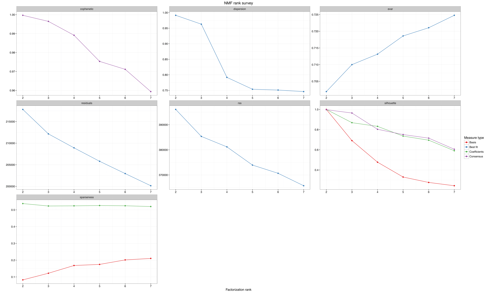
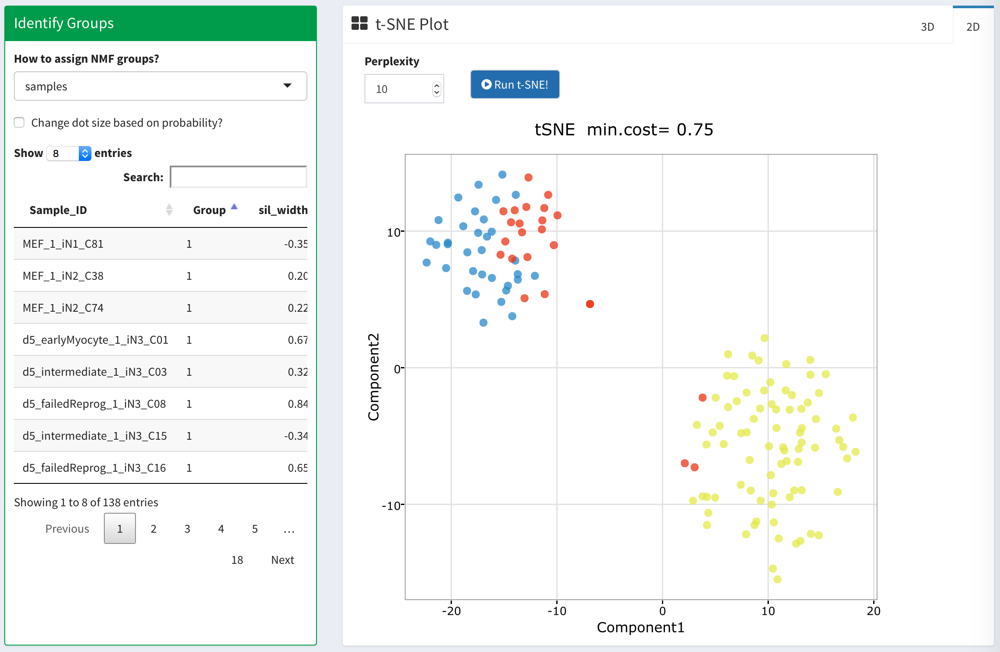
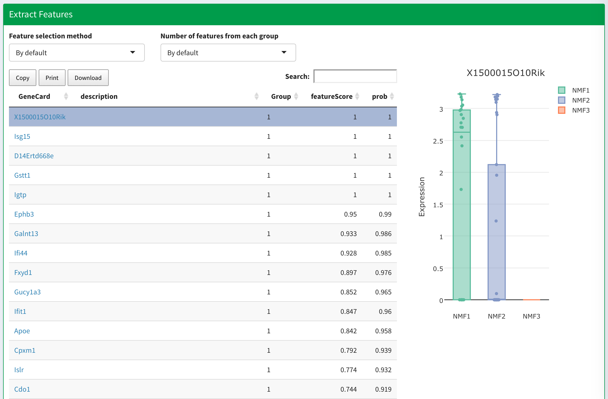

The central part of the package is to utilize non-negative matrix factorization (NMF) to decompose a gene expression matrix V into two nonnegative matrices, W and H, via a multiplicative updates algorithm. NMF was originally developed to be used in image analysis and language processing[cite]. More recently, it has been sucessfully applied to the field of computational biology as an unsupervised clustering method that helps classify samples/patients into functional groups in an unbiased manner [cite].

For running NMF:

- Requires input matrix to be non-negative
- User needs to specify the number of clusters 

## Estimate Number of Clusters

The first step of running NMF is to decide the number of clusters (K) present in the data. In order to do so, we can run NMF on a series of differnt K and pick the one that best fits the underlying data structure. Accoding to the [NMF](http://renozao.github.io/NMF/devel/index.html) package, we can select K based on where the cophenatic value starts to drop. We also suggest investigating the distribution of the silhouette index and picking the K with the highest value. 

An example result of the consensus plot running for different rank (K) using published data^[Treutlein *et al*, Dissecting direct reprogramming from fibroblast to neuron using single-cell RNA-seq, Nature, 2016] is displayed below. In this case, the estimated number of clusters presented in the data is **3**. 

## Run NMF 

After you specify **K**, you can also adjust the number of runs and the initial seed number.

* **Number of runs** - The [NMF](http://renozao.github.io/NMF/devel/index.html) package suggests using `20-30` runs for estimating the number of K and using at least `50-100` runs for real NMF run. 
* **Initial seed number** - You can specify a seed number if you want to get reproducible NMF run result. Otherwise, random seed will be generated for each NMF run and thus the results might be slightly different. The default is set to seed number `123211`. 

## Identify Groups

NMF group information for each sample is displayed on the left; while the [t-SNE](https://lvdmaaten.github.io/tsne/) plot is on the right. In the t-SNE plot, each dot represents a sample and is colored based on NMF assigned groups. The size of the dot can be adjusted proportional to the probability of that sample being assigned to the most appropriate NMF group. From the loadings of that sample being assigned each individual group (K), the probability is calculated as the largest loading divide by the sum of the total loadings for each sample. A higher probability represents higher confidence about the sample being assigned.

Most of the time, samples from each NMF group form tight clusters on the t-SNE plot. This indicates high agreement between two different methods and the robustness of the result. Often times, NMF will separate samples into different groups that seem all closely connected but occupy distinct area in the t-SNE plot, such as the 111 and 222 samples in xxx study. From the t-SNE plot alone, we will not be able to classify these samples if we were to separate them based on the distance metrics from the first few components.  

####

  

In some other cases, samples displayed as two different tight clusters in the t-SNE plot may be assigned into the same NMF group. This happens when NMF is trying to factorize the expression matrix into the specify rank number (K), and the differences between these small sub-clusters are less than the other larger ones **(show examples)**. NMF groups and t-SNE plots are complementary to each other and can thus improve the classification result. An example is shown below.

####

In this figure, the NMF1 cluster (red) appears to contain three distinct t-SNE groupings. We ran NMF on the samples from the NMF1 group  

####

When NMF was run on the NMF1 group, it uncovered three distinct subgroup and verified the results from the earlier t-SNE that NMF1 contains three further subclusters. 

We therefore encourge the user to explore the clustering result and repeat the process for subsets of the data if necessary. This process will be automated in the next version of the package. 

## Feature Clustering

The `feature` tab includes the enriched features in each group. For each gene, a `featureScore` will first be calculated according to formula xxx. Then based on `Lee's` feature selection method, only the feature with featureScores that are outside of 3 median absolute deviation (MAD) of all featureScores will be selected for each group. 

Genes are rank by their featureScores in each group. Users can either click on the name for the gene of interest, and it will link to the `GeneCards`^[GeneCards: http://www.genecards.org] page with more detailed information. Users can also click on the gene (as highlighted in the figure below), the gene expression value for samples in each NMF group will be displayed on the right. As in this example, `X1500015O10Rik` is the enriched feature identified in `NMF group1`, therefore its expression value is expected to be high in `NMF group1`. 

  

## More Information

Users are encouraged to read more about the theory behinds [NMF](http://renozao.github.io/NMF/devel/index.html). 

