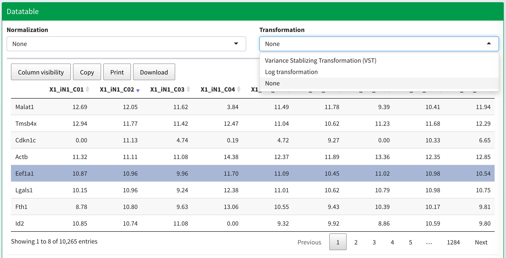
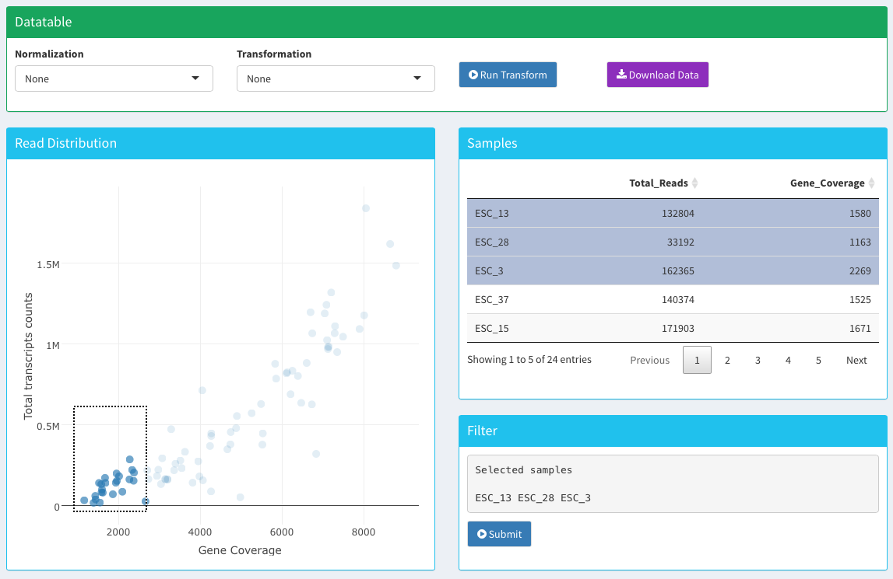

# Data Input 

There are three different ways you can upload files into `sake` pacakge. It can either be 

- Rawdata file 
- Preloaded data
- Saved run result

## Rawdata file

The gene count data file is one of the most common types of data format. Each row represents expression value from a gene, and each column represents transcriptome library derived from a single sample. The package requires the first row to be the header, which you can provide information about each sample. The first column is required to be names/ID for each gene/transcript. 

You can also specify the delimiter according to different file type.

- Tab (\\t) - Default setting for `.txt` or `.out` file
- Comma (,) - Usually used by `.csv` file
- Semicolon (;) - Not so common, but some use this type

Example data sets should look like this

Gene    |MEF-1    |MEF-10   |MEF-11   |MEF-12   |MEF-2
--------|---------|---------|---------|---------|-----
Gm15772 |1493.562 |1714.470 |1178.217 |1858.733 |1199.904
Dnajc3  |75.209   |67.320   |291.554  |49.924   |166.867
Mdn1    |29.288   |7.819    |82.620   |1.262    |0.214
Mfap1b  |4.796    |1.335    |4.308    |0.000    |0.748
Zglp1   |1.939    |78.381   |3.385    |0.541    |3.205
Gm12359 |1.225    |13.159   |1.846    |0.000    |0.320
Gm16039 |0.408    |2.861    |0.154    |0.360    |56.406
Gm11149 |0.204    |0.000    |0.000    |0.000    |0.000

## Preloaded data

There are several preloaded gene expression data from published single-cell studies that were already been preloaded with the package. They include studies relate to neuronal differentiation^[Treutlein *et al*, Dissecting direct reprogramming from fibroblast to neuron using single-cell RNA-seq, Nature, 2016] and circulating tumor cells in pancreatic cancer^[Ting *et al*, Single-Cell RNA Sequencing Identifies Extracellular Matrix Gene Expression by Pancreatic Circulating Tumor Cells, Cell Reports, 2014]. The user can sift through and test each module using these data.    

In this case, we will select data published from Ting *et al*. 

A successfully loaded data will look like this  

***

# Quality Control

You can normalize or transform your raw data after succesfully uploading it. We provide two simple data metrics to help identify samples that deviate from the majority of samples, which may indicate potential low-quality samples that can be removed before downstream analysis.

## Normalization 

Normalization allows you to compare read counts between samples and detect differentially expressed genes by accounting for technical variability between samples and adjusting for their sequencing depth (library size). Two methods to normalize scRNA-seq data are provided.

- **Reads per millions (RPM) normalization**: normalize the gene count from each sample according to their total read count. 

- **DESeq-like normalization**: noramlize the gene count using a method introduced in the [DESeq](http://bioconductor.org/packages/release/bioc/html/DESeq.html) package.

- **Upper quartile normalization**: noramlize the gene count based on upper quartile value from each library

## Transformation 

Transformation allows you to take into account the presence of extreme values in scRNA-seq data and to adjust for mean variance dependency (the observation that genes with higher expression often have larger variances across samples). Two methods to transform scRNA-Seq data are provided.

- **Variance stablizing transformation (VST)**: transform the gene count using a method intoduced in the DEseq package.

- **Log transformation**: transform the gene count by log2(count+1)

## Filtering 
After data normalization or transformation, there are two simple data metrics to help identify samples that deviate from the majority of samples, which can be selected and removed before downstream analysis.

### Read distribution

Read distribution summerizes the total number of read counts for each sample. The read count distribution should be as uniform as possible, and the normalization method you choose will affect the result. Distinctively low read counts may indicate RNA degradation or low sequencing efficiency.

### Gene coverage

Gene coverage summarizes the total number of genes with at least one read in each sample. This number should be relatively stable across libraries. Low gene coverage in a sample can indicate poor quality of a single-cell library. However, the number of expressed genes may be altered based on the difference between cell types, experimental conditions or sequencing protocals, intrinsic heterogeneity among cell population, among other reasons. User should be aware of these factors and decide how to treat outlier samples for downstream analysis.

***

An example QC plot displaying read distribution (x-axis) and gene coverage (y-axis) will be used for identifying potential problematic samples. 

Samples with relatively low total transcript counts and gene coverage rates usually represent degraded or poorly amplified libraries. These can be identified visually and removed from the sample set before proceeding with downstream analyses.
User will be able to use a selection box to highlight samples in the left bottom corner. Samples within the selection box will be shown on the top right table. User can then inspect each of them and click on the ones they want to remove from downstream analysis. Selected samples will be displayed on the bottom right, and user can hit `Submit` button when they are ready to discard these samples. 

In this case, we remove 3 samples `ESC_13, ESC_28`, and `ESC_3` for downstream analysis. 

***

# Filtering 

One of the steps we can do before clustering is to filter genes with small variations due to technical or biological noises.  In this tab we also provide preliminary correlation analysis between all samples, a tool to visualize genetic networks in the data, and a scatter plot comparison of genes in two different samples. 

We provide three different methods to filter genes from your dataset before downstream analysis. 

- **Whole transcriptome:** select whole transcriptome if you want to use all the genes present in your data for downstream analysis. 

- **Rank from data\:** you can rank and filter genes based on simple statistics calculated across each gene. There are currently four ways of ranking genes: mean, median, median absolute deviation (MAD), and variance. In our experience, we find using `Median Absolute Deviation (MAD)` often give us accurate and reproducible results. However, you need to specify the number of top genes to be selected. In general, we suggest using Top **1500 - 3000** MAD genes for `bulk RNA-Seq` data; Top **5000 - 8000** MAD genes for `single-cell RNA-Seq` data. 

- **Upload gene list:** You also have the option to upload a text file which contains your gene of interest. This is typically done when you have a list of marker genes for specific hypothesis and want to see how samples cluster accordingly. 

An example gene list file should look like [this](../inst/extdata/genefile/genelist.EMT.txt):

Gene        | 
------------| -------------
AHNAK       |
BMP1        |
CALD1       |
CAMK2N1     |
CDH2        |
COL1A2      |
COL3A1      |
COL5A2      |
FN1         |

                     
The first row should be a character string **Gene**. The following rows should be the names/IDs of your gene of interest. 
                
## Sample Correlation and Gene Networks

We provide two tools to visualize correlations in your data and observe how filtering affects your data.  

### Sample Correlation 

Sample correlation creates a matrix with your samples as the rows and columns. The tool calculates the `Pearson correlation` between each of your samples using the genes you selected to filter. More similar samples are red, while dissimilar samples are blue. Large groupings of red indicate tight clusters of samples. 

In this case, we might estimate there are 5 major subclusters in this data sets^[Ting *et al*, Single-Cell RNA Sequencing Identifies Extracellular Matrix Gene Expression by Pancreatic Circulating Tumor Cells, Cell Reports, 2014]. This is just to provide an overview of how the samples correlate with each other using `Pearson correlation`. However, `Pearson correlation` can easily be altered by few genes with high expression. Therefore, we tend to be more confident about the clustering result identified from using NMF method which will be described in the next section.  
                    
                    
### Gene Network 
This tool analyzes genes whose expression is co-expressed with one another and creates a visual network to view these associations. Currently we use the absolute value of `Pearson correlation` to assess the strength of the connectivity. Hub genes indicate genes that are highly connected to other genes within the same network, and these genes are usualy the candidate genes for further investigation.

In this example, we will only use the **Top MAD 1500** genes for running this module. 

## Sample scatter plot

You can compare the expression levels of whole transcriptome between two samples with a scatter plot. Genes that lie above the reference line are more highly expressed in the sample on the Y-axis, while genes that lie below the reference line are more highly expressed in the sample in the X-axis. Users can choose to log transform their gene counts, display *R^2^* coefficent of determination, or show a two-fold change line to assess genes that have large changes in expression between the two samples. 

***

# NMF

The central part of the package is to utilize non-negative matrix factorization (NMF) to decompose a gene expression matrix V into two nonnegative matrices, W and H, via a multiplicative updates algorithm. NMF was originally developed to be used in image analysis and language processing[cite]. More recently, it has been sucessfully applied to the field of computational biology as an unsupervised clustering method that helps classify samples/patients into functional groups in an unbiased manner^[Genomic Classification of Cutaneous Melanoma., Cell, 2015].

For running NMF:

- Requires input matrix to be non-negative
- User needs to specify the number of clusters 

## Estimate Number of Clusters

The first step of running NMF is to decide the number of clusters (K) present in the data. In order to do so, we can run NMF on a series of differnt K and pick the one that best fits the underlying data structure. Accoding to the [NMF](http://renozao.github.io/NMF/devel/index.html) package, we can select K based on where the *cophenatic* value starts to drop. We also suggest investigating the distribution of the *silhouette index* and picking the K with the highest value. 

An example result of the consensus plot running for different rank (K) using published data^[Ting *et al*, Single-Cell RNA Sequencing Identifies Extracellular Matrix Gene Expression by Pancreatic Circulating Tumor Cells, Cell Reports, 2014] is displayed below. In this case, the estimated number of clusters presented in the data is **5**. 

*Note: It takes around 20 minutes to run 20 iterations for each K on a MacBook Pro (Retina, 15-inch, Mid 2015), 2.5 GHz Intel Core i7, with 16 GB 1600 MHz DDR3*

## Run NMF 

After you specify **K**, you can also adjust the number of runs and the initial seed number.

* **Number of runs** - The [NMF](http://renozao.github.io/NMF/devel/index.html) package suggests using `20-30` runs for estimating the number of K and using `50-100` runs for real NMF run. 
* **Initial seed number** - You can specify a seed number if you want to get reproducible NMF run result. Otherwise, random seed will be generated for each NMF run and thus the results might be slightly different. The default is set to seed number `123211`. 

*Note: In this case, we will just run NMF for 50 iterations for demostration purpose. It is suggested to run `50-100` iterations to get a more robust results. Again, it takes around 6 minutes to finish 50 iterations on a MacBook Pro (Retina, 15-inch, Mid 2015), 2.5 GHz Intel Core i7, with 16 GB 1600 MHz DDR3* 

## Identify Groups

NMF group information for each sample is displayed on the left; while the [t-SNE](https://lvdmaaten.github.io/tsne/) plot is on the right. In the t-SNE plot, each dot represents a sample and is colored based on NMF assigned groups. The size of the dot can be adjusted proportional to the probability of that sample being assigned to the most appropriate NMF group. From the loadings of that sample being assigned each individual group (K), the probability is calculated as the largest loading divide by the sum of the total loadings for each sample. A higher probability represents higher confidence about the sample being assigned.

Most of the time, samples from each NMF group form tight clusters on the t-SNE plot. This indicates high agreement between two different methods and the robustness of the result. Often times, NMF will separate samples into different groups that seem all closely connected but occupy distinct area in the t-SNE plot, such as the red, yellow, and blue color samples. From the t-SNE plot alone, we will not be able to classify these samples if we were to separate them based on the distance metrics from the first few components. This highlights the strength of NMF on classifying samples in this case. 

####

  

## Enriched Features

The `feature` tab includes the enriched features in each group. For each gene, a `featureScore` will first be calculated according to formula. Then based on `Lee's` feature selection method, only the feature with featureScores that are outside of 3 median absolute deviation (MAD) of all featureScores will be selected for each group. 

Genes are rank by their featureScores in each group. Users can either click on the name for the gene of interest, and it will link to the `GeneCards`^[GeneCards: http://www.genecards.org] page with more detailed information. Users can also click on the gene (as highlighted in the figure below), the gene expression value for samples in each NMF group will be displayed on the right. As in this example, `Gp9` is the enriched feature identified in `NMF group1`, therefore its expression value is expected to be highest in `NMF group1`. 

  

## More Information

Users are encouraged to read more about the theory behinds [NMF](http://renozao.github.io/NMF/devel/index.html). 

***

# Visualization

Users can visualize how NMF clusters their data using t-SNE, PCA and heat map. Both PCA and t-SNE can be used to reduce high-dimensional gene expression data into two or three dimensions and to help find clusters of similarity in gene expression data. A heatmap tool is also provided to visualize patterns of gene expression across a large numbers of samples. 

## t-SNE

[t-SNE](https://lvdmaaten.github.io/tsne/) is a non-linear form of dimensional reduction that gives each sample a location on a two or three dimensional grid. The user can filter the genes used during t-SNE using four different ranking metrics: mean expression, median expression, MAD, and variance. Like for NMF, we recommend using using Top **1500 - 3000** MAD genes for `bulk RNA-Seq` data; Top **5000 - 8000** MAD genes for `single-cell RNA-Seq` data.  

Under more options, the user can further modify t-SNE:

- **Sample color:** the user can color the sample points either by filename, NMF group assignment, or the level of expression of a specified gene.

- **Perplexity:** perplexity is the number of neighbors used when computing t-SNE for each datapoint. A smaller perplexity will result in tighter clusters, while a higher perplexity will result in more diffuse clusters. 

- **Iterations:** t-SNE will run for a selected number of iterations and choose the optimal dimensional reduction. Generally, we found that the number of iterations did not impact the results of t-SNE.

As mentioned in the earlier section on NMF, concordance of NMF groups and t-SNE clusters indicate the robustness of the results. It's important to use NMF clustering in addition to t-SNE dimensional reduction because NMF can help assign data points to clusters otherwise difficult to group because they are between two distinct but closely connected t-SNE groupings.

SAKE provide t-SNE plots both in 2-D and 3-D in order for users to better understand the clustering results from running NMF. 

## PCA 

Principal component analysis (PCA) is a dimensional reduction technique that finds interrelated variables within data and reduces them into a set of fewer uncorrelated variables that explain the most variance in the data. The principal components are ordered by the amount of variance in the data they explain (e.g. the first principal component explains the most variance in the data). The first two or three principal components can be used to visualize data by plotting data points using the principal components as axes. 

As with t-SNE and NMF, the user has the option to filter the number of genes used to calculate the principal components with four different ranking metrics: mean expression, median expression, MAD, and variance. We recommend using using Top **1500 - 3000** MAD genes for `bulk RNA-Seq` data; Top **5000 - 8000** MAD genes for `single-cell RNA-Seq` data.  

The user can choose which principal components to use as axes to visualize their data. The default is to use the first and second principal components for 2D PCA, and the first, second, and third axes for 3D PCA. 

The user can also designante the size of each sample dot, whether to display its label, the size of the label, and the alpha value (the transparency of each of the dots).

## Heatmap

Heatmaps help with visualizing patterns in gene expression across multiple samples. Each column is a different sample and each row is a different gene. 

There are five options for selecting sets of genes to analyze:

- **Preloaded gene list:** the user can select from preloaded gene lists with gene signatures of various cell types and cell states derived from published literature. 

- **Ranks from data\:** the user can filter a selected number of genes to analyze using four different metrics: median absolute deviation, median expression, mean expression, and variance. 

- **Manually select genes:** the user can select genes that is presented in the input data. Usually this is helpful when you know 

- **From NMF features:** the user can select genes that are found to be uniquely enriched in a particular NMF group. NMF enriched genes will be highly expressed in their NMF groups and poorly expressed in the other samples. 

An example heatmap using genes from NMF features will look this. The color bar on the top of the heatmap indicates which NMF group each sample is assigned to.  

- **Upload gene list:** the user can upload their own gene list. 

An example gene list file should look like [this](../inst/extdata/genefile/genelist.EMT.txt):

Gene        | 
------------| -------------
AHNAK       |
BMP1        |
CALD1       |
CAMK2N1     |
CDH2        |
COL1A2      |
COL3A1      |
COL5A2      |
FN1         |

                     
The first row should be a character string **Gene**. The following rows should be the names/IDs of your gene of interest. 
                
### More options

Under more options, the user can change the parameters of the heatmap.

- **Column and row colors:** the user can change how the rows and columns are colored. Under column colors, the user can color the sample columns by their filename or by their NMF group.

- **Heatmap color scheme:** the user to pick from several different color schemes used to show highly expressed and poorly expressed genes. 

- **Column clustering:** the user can choose to cluster their samples based on NMF grouping, filenames, the expression of a particular gene, or a hierarchical clustering method. 

- **Distance and Linkage:** hierarchical clustering is used with the heatmap to help determine the relationships and similarities between samples (columns) and genes (rows). Like t-SNE, hierarchical clustering can be beneficial to use with NMF clustering. We provide several different metrics for computing distances and linkages in hierarchical clusters. 

## Summary Stats

