# Test case1: Ting
Yu-Jui Ho and Toby Aicher, M Hammell Lab  
`r Sys.Date()`  

# Data Input 

There are three different ways you can upload files into `sake` pacakge. It can either be 

- New Gene Count Data File 
- Pre-loaded Demo Data (for testing)
- Saved run result (for advanced users)

## New Gene Count Data file

The gene count data file is one of the most common formats for RNA-seq assays. Each row represents the expression value for a gene (in raw counts or normalized RPM, TPM, etc.), and each column represents a single sample. The package requires the first row to be the header, containing unique names for each sample. The first column is required to be the names/ID for each gene/transcript. 

While the gene count file is expected to be tab-demlited, you can specify other characters used to separate fields.

- Tab (\\t) - Default setting for `.txt` or `.out` file
- Comma (,) - Usually used by `.csv` file
- Semicolon (;) - Less common

Example data sets should look like this

Gene    |MEF-1    |MEF-10   |MEF-11   |MEF-12   |MEF-2
--------|---------|---------|---------|---------|-----
Gm15772 |1493.562 |1714.470 |1178.217 |1858.733 |1199.904
Dnajc3  |75.209   |67.320   |291.554  |49.924   |166.867
Mdn1    |29.288   |7.819    |82.620   |1.262    |0.214
Mfap1b  |4.796    |1.335    |4.308    |0.000    |0.748
Zglp1   |1.939    |78.381   |3.385    |0.541    |3.205
Gm12359 |1.225    |13.159   |1.846    |0.000    |0.320
Gm16039 |0.408    |2.861    |0.154    |0.360    |56.406
Gm11149 |0.204    |0.000    |0.000    |0.000    |0.000

## Pre-loaded Demo Data

There are several pre-loaded gene expression datasets from published single-cell studies available for learning how to use the SAKE package. These include  one study exploring neuronal differentiation over a time-course^[Treutlein *et al*, Dissecting direct reprogramming from fibroblast to neuron using single-cell RNA-seq, Nature, 2016] as well as a second study evaluating circulating tumor cells in a pancreatic cancer mouse model^[Ting *et al*, Single-Cell RNA Sequencing Identifies Extracellular Matrix Gene Expression by Pancreatic Circulating Tumor Cells, Cell Reports, 2014]. These datasets allow the user to reproduce the analysis results presented in in the SAKE paper.

An example screenshot shows selection of the pre-loaded data set downloaded from GEO and published in Ting *et al* (2014). 

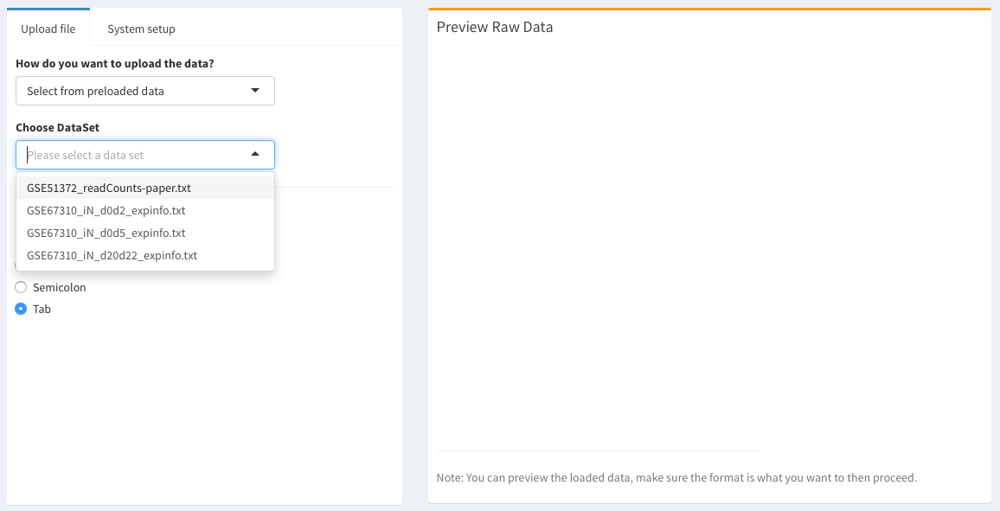

A successfully loaded data will look like this  

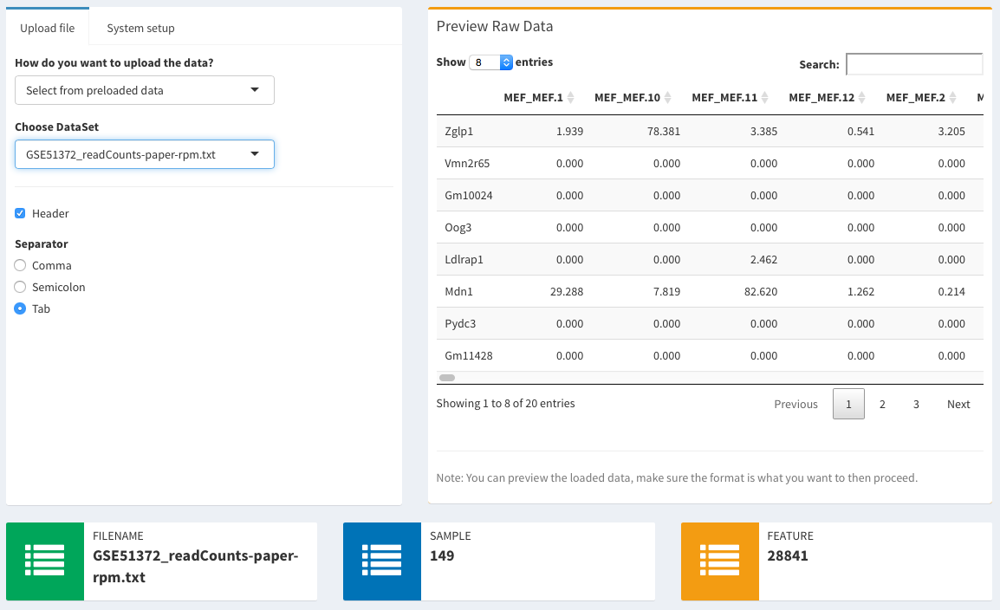

***

## Saved run result

Users familiar with SAKE have the option to run most of the computationally intensive portions of the SAKE clustering  algorithm on their own clustered compute servers, then upload these results to our web host for interactive analysis of the results. This is especially useful when the sample sizes of the single-cell study become too large for this web host to analyze in real time (greater than ~200 cells). The previous run results can be saved in [.rda](https://stat.ethz.ch/R-manual/R-devel/library/base/html/load.html) format and then loaded back to `sake`. Saved run results will include data analysis of NMF, t-SNE, and DESeq2 (if specified). Uploading these results to the `sake` server allows for interactive figure generation. 

Example saved data can be downloaded [here](../data/Ting.NMF5.rda)

***

# Quality Control

Following succesful data upload, the gene count expression table must be normalized before proceeding with quality control and analysis. We provide several options for data normalization, variance stabilizing transformations, and quality control (QC). QC analysis is generally aimed at identifying very noisy samples due to technical issues in library construction and/or sample preparation. Two simple data metrics can help identify samples unusually low transcript counts or coverage rates, as described below.

## Normalization 

Normalization allows you to compare read counts between samples and detect differentially expressed genes by accounting for sequencing depth (library size). Three methods to normalize scRNA-seq data are provided.

- **Reads per million mapped (RPM) normalization**: normalize each sample gene count based on the total reads derived from all annotated genes in the library. 

- **DESeq-like normalization**: noramlize the gene count using a method introduced in the [DESeq](http://bioconductor.org/packages/release/bioc/html/DESeq.html) package.

- **Upper quartile normalization**: normalize each sample gene count based on the total counts attributed to the upper quartile of expressed genes in the library.

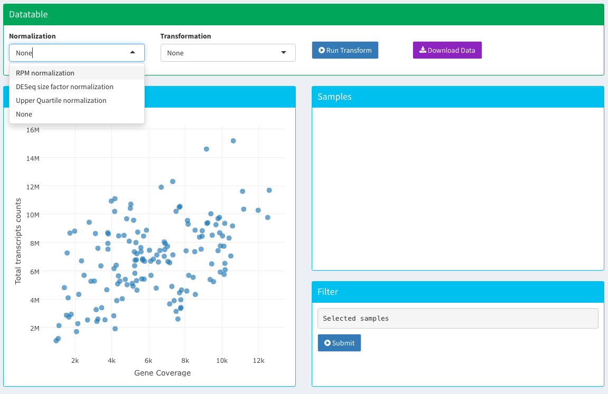

## Transformation 

Transformation mitigates the effects of extreme values in scRNA-seq data (from the large dynamic range measured) and adjusts for mean-variance dependency (the observation that genes with higher expression often have larger aboslute variance across samples). Two methods to transform scRNA-Seq data are provided.

- **Variance stablizing transformation (VST)**: transform the gene count using a method intoduced in the DEseq package.

- **Log transformation**: transform the gene count by *log2(count+1)*

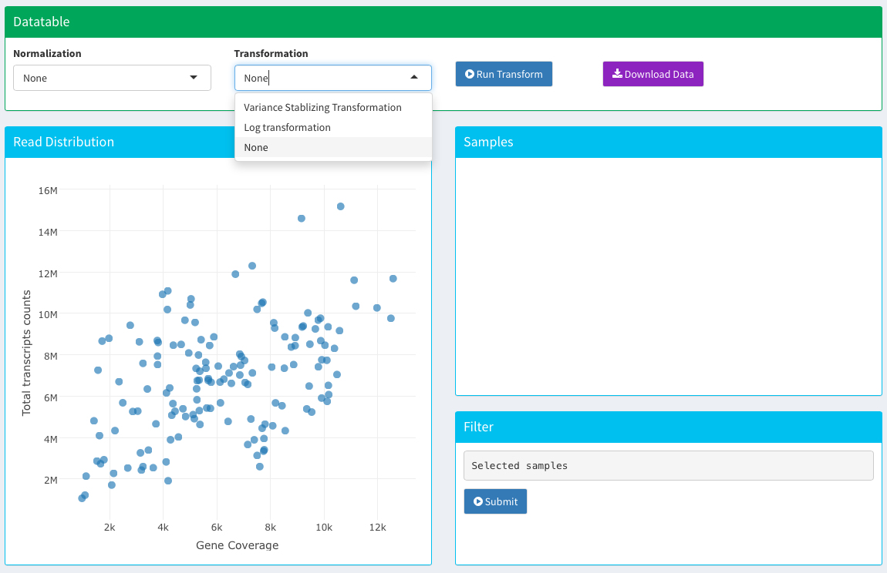

## Filtering 
After data normalization or transformation, there are two simple data metrics to help identify samples that deviate from the majority of samples with respect to total gene counts sampled and total genes covered by at least one read. These problematic samples can be selected and removed before downstream analysis.

### Read Counts Distribution

The read counts distribution summerizes the total number of read counts annotated to known genes for each sample. The read count distribution should be as uniform as possible, and the normalization method you choose will affect this result. Distinctively low read counts may indicate technical issues such as RNA degradation, low amplification rate, or low sequencing efficiency.

### Gene Coverage

Gene coverage summarizes the total number of genes with at least one read in each sample. This number should be relatively stable across libraries. Low gene coverage in a sample can indicate poor quality of a single-cell library. However, the number of expressed genes may also be altered based on biological differences between cell types or experimental conditions, or intrinsic heterogeneity among cell populations. Selection of outlier samples for pre-analysis removal is optional, but can improve downstream analysis.

*** 

An example QC plot displaying read distribution (x-axis) and gene coverage (y-axis) will be used for identifying potential problematic samples. 

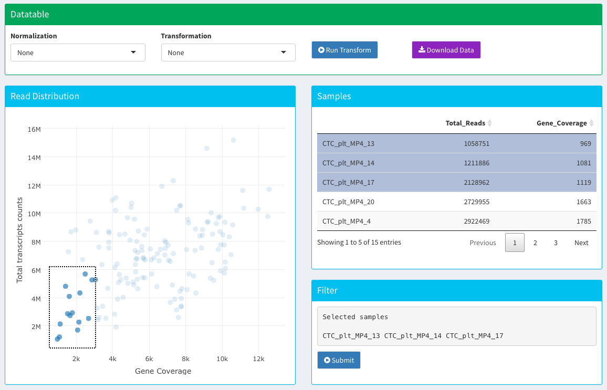

Samples with relatively low total transcript counts and gene coverage rates usually represent degraded or poorly amplified libraries. These can be identified visually and removed from the sample set before proceeding with downstream analyses. User can use a selection box to highlight samples in the left bottom corner. Samples within the selection box will be shown on the top right table. User can then click on each library identified as problematic in the table at right. Clicking the *"Submit"*  button will discard all highlighted samples from further analysis in the SAKE pipeline. 

In the example case shown above, 3 samples have been selected for removal: `CTC_plt_MP4_13, CTC_plt_MP4_14`, and `CTC_plt_MP4_17` based on very low gene coverage/library size rates (less than 1500 genes sampled and fewer than ~2.2 million reads sequenced). 

*Note: Users have to be cautious when removing samples. Outliers may represent a special cell type with very different transcriptomic patterns relative to all other cells. *

***

# Gene List Filtering 

Data clustering analysis can be strongly affected by the input gene lists used for calculating distances between samples. Ideally, one would prefer to use a gene list with large variations across samples, and where these variations reflect biological differences that separate cell types. Several options are provided in SAKE to allow for filtering of the input gene list before proceeding to data clustering.  We also provide several visualization tools to evalutae the effects of gene list filtering on the resulting data including: preliminary correlation analysis between all samples, gene network visualization tools, and simple pairwise scatter plots between samples. 

## Filtering

We provide three different methods to filter genes from your dataset before downstream analysis. 

- **Whole transcriptome:** select whole transcriptome if you want to use all expressed genes for downstream analysis. 

- **Top Ranks:** you can rank and filter genes based on simple statistics calculated for each gene across all samples. There are currently four ways of ranking genes: mean, median, median absolute deviation (MAD), and variance. Using the top ranked genes by "mean" or "median" equates to using the most abundant genes for downstream analysis. Using the top ranked genes by "variance" equates to using the genes that change the most across samples, but this gene list can often be dominated by noise from low abundance genes.  In our experience, we find using gene lists with the top ranked `Median Absolute Deviation (MAD)` often gives the most reproducible results, as these genes have relatively high abundance and also show differential abundance between samples.  We suggest using the Top **5000 - 8000** MAD genes for `single-cell RNA-Seq` data. 

- **Upload gene list:** You also have the option to upload a text file which contains your pre-determined genes of interest. This is typically done when you have a list of marker genes used to test a specific hypothesis and want to see how samples cluster accordingly. 

An example gene list file should look like [this](../inst/extdata/genefile/genelist.EMT.txt):

Gene        | 
------------| -------------
AHNAK       |
BMP1        |
CALD1       |
CAMK2N1     |
CDH2        |
COL1A2      |
COL3A1      |
COL5A2      |
FN1         |

                     
The first row should be a character string **Gene**. The following rows should be the names/IDs of your gene of interest. 
                
## Sample Correlation and Gene Networks

We provide two tools to visualize correlations in your data and observe how filtering affects these correlations.  

### Sample Correlation 

Sample correlation creates a matrix with your samples as the rows and columns. The tool calculates the `Pearson correlation` between each of your samples using the genes you selected above. More similar samples are red, while dissimilar samples are blue. Large groupings of red indicate tight clusters of samples^[Wei et al, https://github.com/taiyun/corrplot]

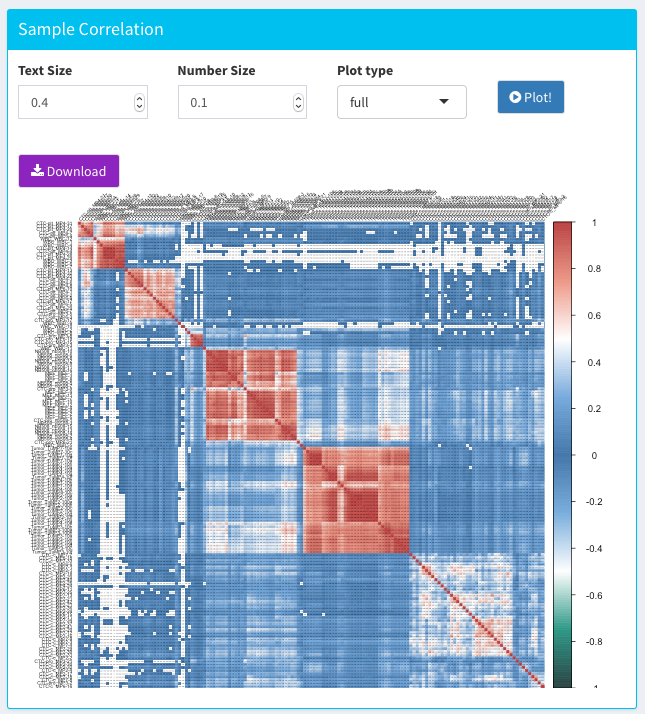

In the case shown above, we might estimate there are likely 5 major subclusters in this data set^[Ting *et al*, Single-Cell RNA Sequencing Identifies Extracellular Matrix Gene Expression by Pancreatic Circulating Tumor Cells, Cell Reports, 2014]. This is just to provide an overview of how the samples correlate with each other using `Pearson correlation`. However, `Pearson correlation` can easily be altered by a few genes with high expression. Therefore, we tend to be more confident about the clustering results identified from using the NMF method which will be described in the next section.  
                    
                    
### Gene Network 
This tool identifies genes whose expression is correlated with one another across samples and creates a visual network to view these associations. Currently we use the absolute value of `Pearson correlation` to assess the strength of the connectivity^[Gandrud et al, https://christophergandrud.github.io/networkD3/]. Hub genes indicate genes that are highly connected to other genes within the same network -- these genes can often provide good candidate marker genes for further investigation.

In this example, we used the **Top MAD 1500** genes from the same dataset shown in the heatmap above for running this gene expression network module. 

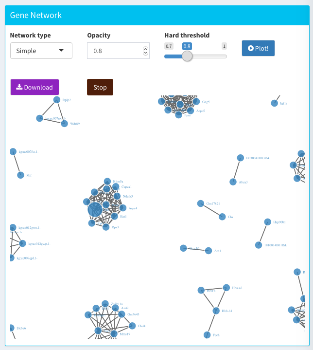

## Sample scatter plot

You can compare the expression levels of whole transcriptome between two samples with a scatter plot. Genes that lie above the reference line are more highly expressed in the sample on the Y-axis, while genes that lie below the reference line are more highly expressed in the sample in the X-axis. Users can choose to log transform their gene counts, display *R^2^* coefficent of correlation, or show a two-fold change line to assess genes that have large changes in expression between the two samples. 

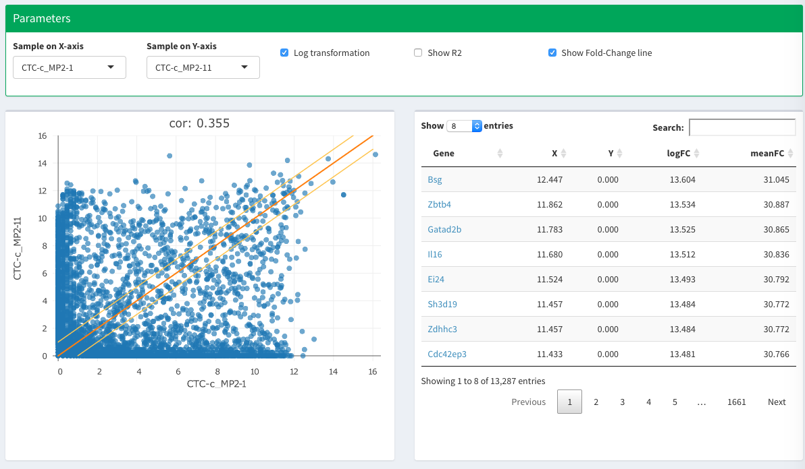

***

# NMF

The central part of the SAKE package uses non-negative matrix factorization (NMF) to decompose a gene expression matrix V into two non-negative matrices, W and H, via a multiplicative updates algorithm. NMF was originally developed to be used in image analysis and language processing^[Lee and Seung, Learning the parts of objects by non-negative matrix factorization, Nature, 1999]. More recently, it has been sucessfully applied to the field of computational biology as an unsupervised clustering method that helps classify samples/patients into functional groups in an unbiased manner^[Genomic Classification of Cutaneous Melanoma., Cell, 2015].

For running NMF:

- Requires an input matrix to of non-negative expression values
- Requires a two-step procedure where users first identify the most likely number of clusters present in the dataset and then identify which samples belong to each expression cluster. 

## Estimate Number of Clusters

The first step of running NMF is to decide the number of clusters (K) present in the data. In order to do so, we  run NMF simultaneously with several different values of K, then use the supplied graphical representations of distance metrics to pick the value of K that best fits the underlying data structure. SAKE relies on the published [NMF](http://renozao.github.io/NMF/devel/index.html) R package of Gaujoux & Seoighe (2010). We have obtained robust results by choosing the value, K, at which the *cophenetic* coefficient begins to drop, as suggested in Brunet et al (2004). The cophenetic coefficient measures the similarity between samples within a single cluster relative to similarities between that sample and other samples not in the same cluster, with higher cophenetic coefficients corresponding to higher within-cluster similarity. We also suggest investigating the distribution of the *silhouette index* and picking the K with the highest value. 

An example result is shown below for the consensus plots and distributions of cophenetic coefficients and silhouette index for different values of K using a published single-cell RNA-seq dataset^[Ting *et al*, Single-Cell RNA Sequencing Identifies Extracellular Matrix Gene Expression by Pancreatic Circulating Tumor Cells, Cell Reports, 2014] is displayed below. In this case, the estimated number of clusters present in the data is **5**, as indicated by the consensus plots, cophenetic coefficients, and silhouette index. 

*Note: It takes around 20 minutes to run 20 iterations for each value of K on a MacBook Pro (Retina, 15-inch, Mid 2015), 2.5 GHz Intel Core i7, with 16 GB 1600 MHz DDR3*

## Run NMF 

After determining the value of **K**, we suggest running NMF for several randomized iterations using that value of K in order to estimate the robustness of cluster marker genes and cluster membership of each sample.

* **Number of runs** - The [NMF](http://renozao.github.io/NMF/devel/index.html) package suggests using `20-30` runs for estimating the number of K and using `50-100` runs for a final NMF set of iterations. 
* **Initial seed number** - You can specify a seed number for a deterministic NMF run result. Otherwise, random seeds will be generated for each NMF run, which may give slightly different results for small run numbers. The default is to set the seed to `123211`. 

*Note: For the case displayed below, we  have used 50 iterations for a demostration NMF run. It is suggested to run `50-100` iterations for more robust results. It takes around 6 minutes to finish 50 iterations on a MacBook Pro (Retina, 15-inch, Mid 2015), 2.5 GHz Intel Core i7, with 16 GB 1600 MHz DDR3* 

## Identify Groups

Following the final NMF run, NMF group assignment for each sample is displayed on the left; while a [t-SNE](https://lvdmaaten.github.io/tsne/) plot coloring each sample by NMF-assigned group is displayed on the right. The size of the dot used for each sample can be adjusted proportionally to the probability of that sample being assigned to the most appropriate NMF group. The probability of correct assignment for each sample is estimated by calculating the loading weight of that sample in the assigned group and dividing by the sum of the total loading weights for that sample in all other groups. A higher probability represents higher confidence that a sample has been robustly assigned to the correct group.

Usually, samples from the same NMF group form tight clusters on the t-SNE plot. This indicates high agreement between two independent and robust methods of calculating sample similarity. In some cases, NMF will separate samples into different groups, while t-SNE indicates that these samples occupy similar but distinct areas in the t-SNE projection plot, such as the red, yellow, and blue color samples displayed below. From the t-SNE plot alone, we would not assume that these samples represented distinct clusters.  In this example, these samples do indeed derive from distinct cell types highlighting the strength of NMF in classifying related samples into distinct clusters. 

####

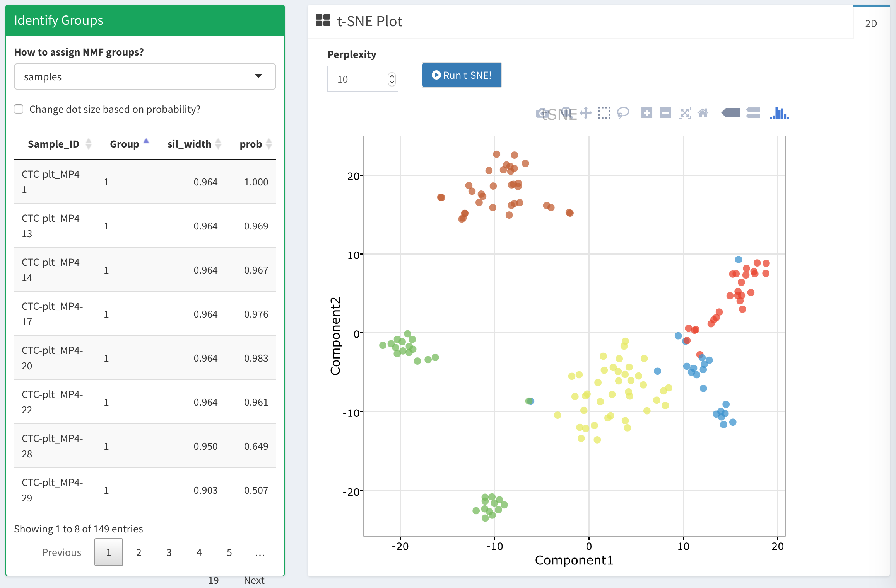  

## Enriched Features

The `feature` tab includes the enriched features (gene markers) in each NMF-assigned group. For each gene, a `featureScore` will be calculated indicating the relative specificity of that gene in separating clusters from each other.  Then based on `Kim & Park's` feature selection method (2007), only the genes with featureScores that are greater than 3 median absolute deviations (MAD) away from all other featureScores will be selected as markers for each group. 

Genes are ordered by their featureScore ranks in each group. Users can click on the name of the gene of interest, which will link to the `GeneCards`^[GeneCards: http://www.genecards.org] page with more detailed information. Users can also click on the gene row (as highlighted in the figure below), which will display a boxplot of the gene expression values across samples in each NMF group, at right. In this example, `Gp9` is an enriched feature identified in `NMF group1`, therefore its expression value is expected to be generally highest in `NMF group1`. 

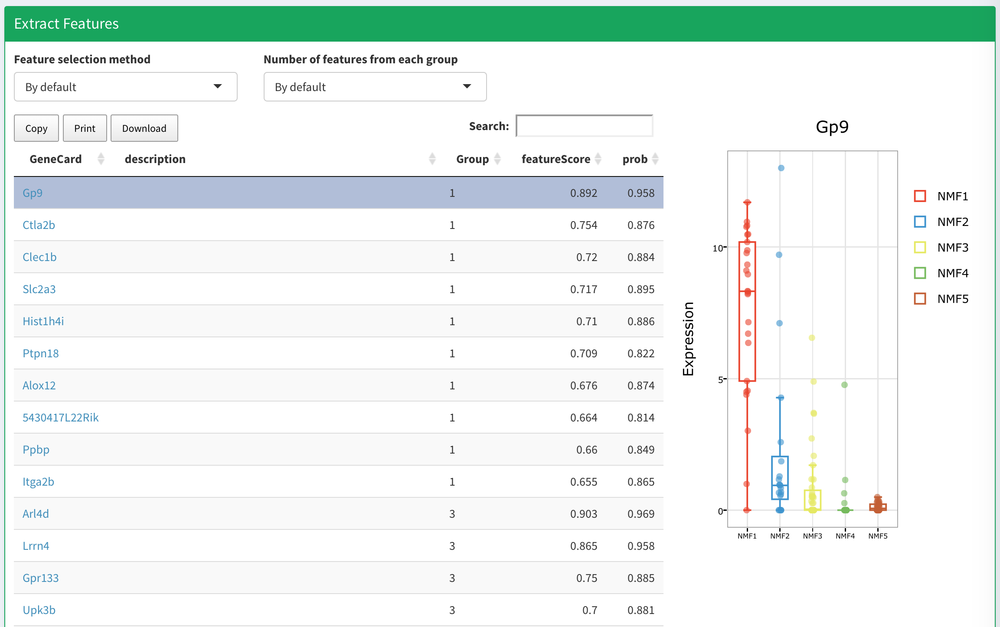  

## More Information

Users are encouraged to read more about the methods and implementation of [NMF](http://renozao.github.io/NMF/devel/index.html). 

***

# Visualization

Following identification of NMF clusters and sample assignemnts, SAKE provides several options for interactive data viusualization. Users can explore their NMF clusters through t-SNE and PCA projection plots. Users can also create standard gene expression heatmaps to, for example, evaluate gene expression patterns across samples in NMF clusters.

## t-SNE

[t-SNE](https://lvdmaaten.github.io/tsne/) is a non-linear form of dimensional reduction that gives each sample a location on a two or three dimensional grid. Early successful results of t-SNE maps in separating single cells of distinct origin have made t-SNE maps a popular choice for display of single-cell RNA-se data. The user can filter the genes used during t-SNE using four different ranking metrics: mean expression, median expression, MAD, and variance. Like for NMF, we recommend using using Top **1500 - 3000** MAD genes for `bulk RNA-Seq` data; Top **5000 - 8000** MAD genes for `single-cell RNA-Seq` data.  

Under more options, the user can further modify t-SNE:

- **Sample color:** the user can color the sample points either by filename, NMF group assignment, or the level of expression of a specified gene.

- **Perplexity:** perplexity is the number of neighbors used when computing t-SNE for each datapoint. A smaller perplexity will result in tighter clusters, while a higher perplexity will result in more diffuse clusters. 

- **Iterations:** t-SNE will run for a selected number of iterations and choose the optimal dimensional reduction. Generally, we found that the number of iterations did not greatly impact the t-SNE display.

As mentioned in the earlier section on NMF, concordance of NMF groups and t-SNE clusters indicate the robustness of both methods for identifying expresison clusters in RNA-seq datasets. It's important to use NMF clustering in addition to t-SNE visualization maps because NMF can help quantitatively assign data points to clusters that occupy distinct but closely connected t-SNE groupings.

SAKE provide t-SNE plots both in 2-D and 3-D for users to better understand the clustering results. 

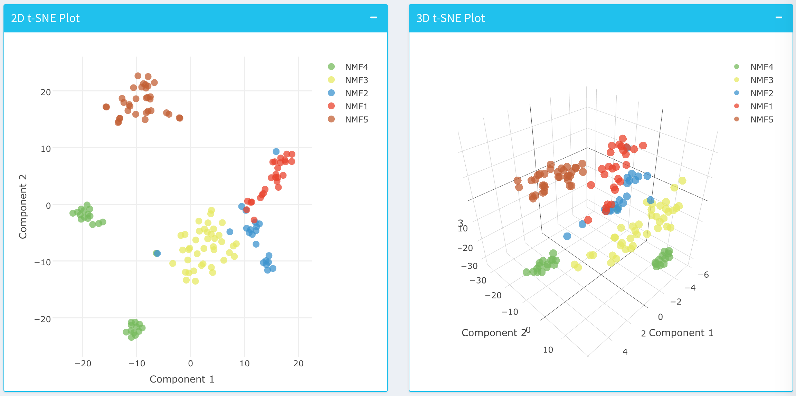

## PCA 

Principal component analysis (PCA) is a dimensional reduction technique that finds inter-related variables within data and reduces them into a smaller set of independent variables that explain most of the variance in the data. The principal components are ordered by the amount of variance in the data they explain (e.g. the first principal component explains the most variance in the data). The first two or three principal components can be used to visualize data by plotting data points using the principal components as axes. 

As with t-SNE and NMF, the user has the option to filter the number of genes used to calculate the principal components with four different ranking metrics: mean expression, median expression, MAD, and variance. We recommend using using Top **1500 - 3000** MAD genes for `bulk RNA-Seq` data; Top **5000 - 8000** MAD genes for `single-cell RNA-Seq` data.  

The user can choose which principal components to use as axes to visualize their data. The default is to use the first and second principal components for 2D PCA, and the first, second, and third axes for 3D PCA. 

The user can also designante the size of each sample dot, whether to display its label, the size of the label, and the alpha value (the transparency of each of the dots).

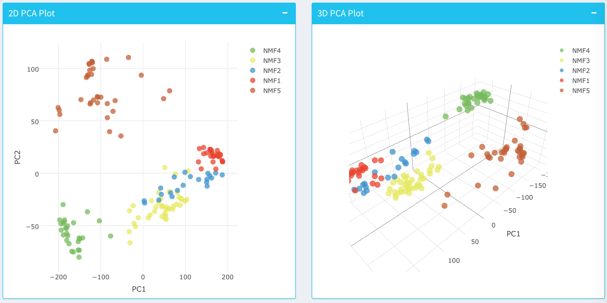

### Compare with published results

SAKE provides options to color samples based on NMF groups, filename, or expression level for specific markers. 

- **NMF groups:** By default, samples are colored based on NMF group assignments.
- **Filename:** User can modify the colnames of the input gene count table to include experimental information that might be useful for comparison or check for batch effect. There can be mutliple categories separated by `_`. For example: `Type1` \_ `Batch1` \_ `Lane1`

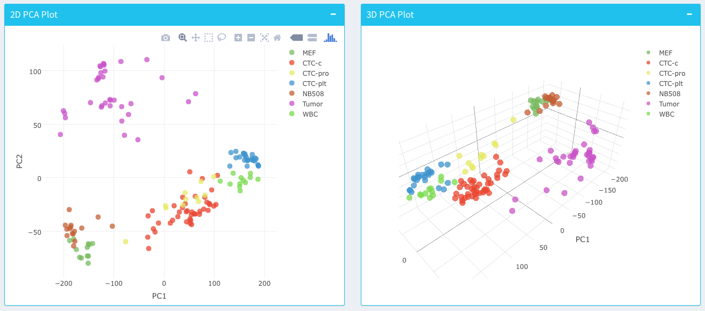

*Note: we can change the coloring order of the NMF group to match the colors derived from filename. This function will be implemented soon in the next version of the package*
  
   
- **Specific markers:** User can also select specific markers from the drop down menu and check whether the expression of this gene/transcript is expressed in particular NMF group. 

We will demonstrate by plotting *`Klf4`* (key stem cell reprogramming factors marker) and *`Igfbp5`* (extracellular growth factor binding protein) according to Ting et al, 2014. 

*`Klf4`* is enriched in `NMF group3`, whereas most of the samples in this group are marked as `CTC-c` in original published results. 

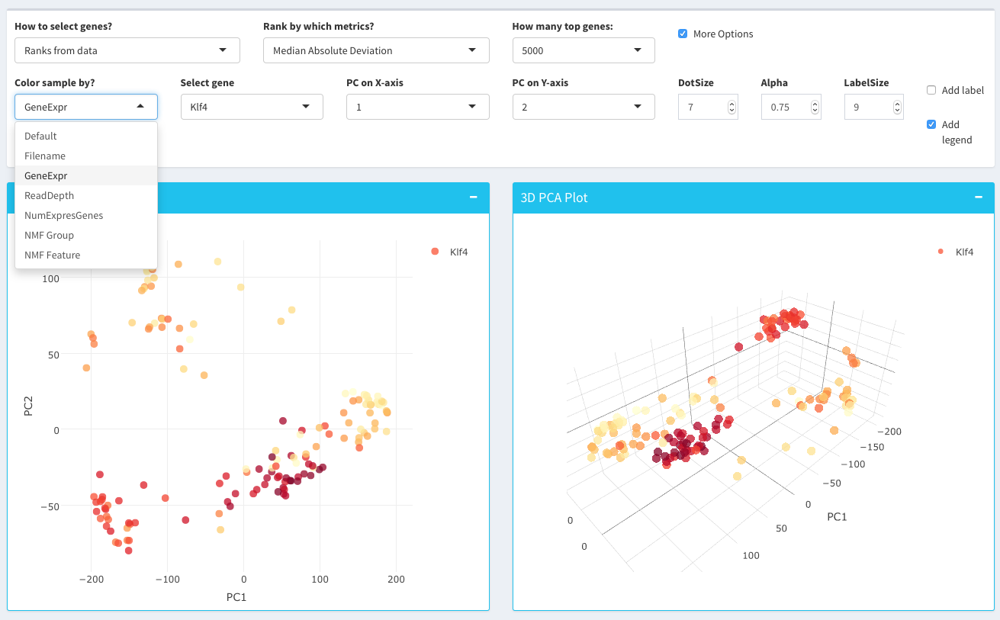

*`Igfbp5`* is enriched in `NMF group3`, whereas most of the samples in this group are marked as `CTC-c` in original published results. 

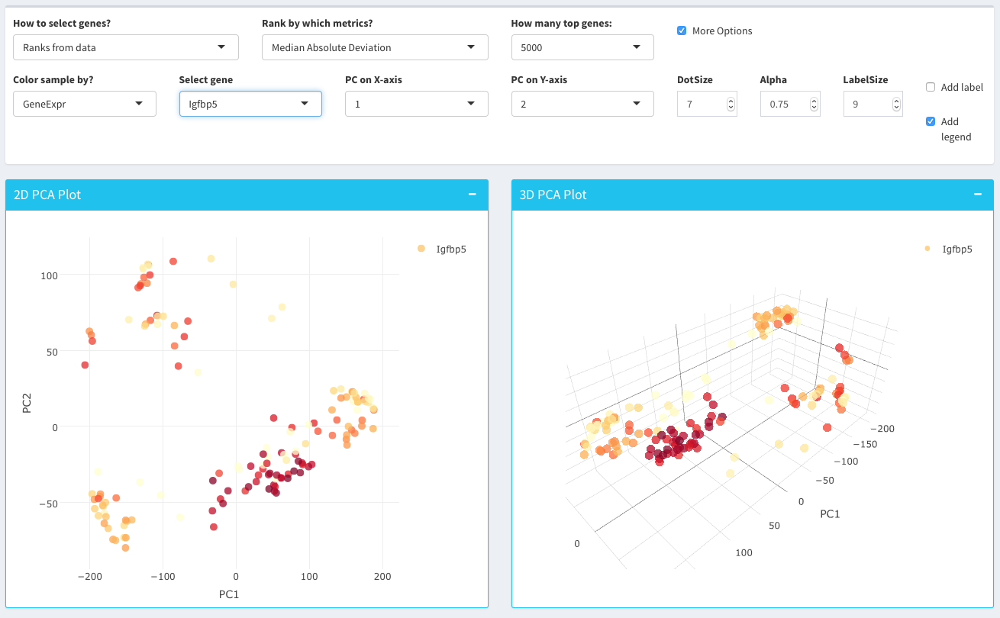

## Heatmap

[Heatmaps](https://cran.r-project.org/web/packages/heatmap3/index.html) help with visualizing patterns in gene expression across multiple samples. Each column is a different sample and each row is a different gene. 

There are five options for selecting sets of genes to analyze:

- **Preloaded gene list:** the user can select from preloaded gene lists with gene signatures of various cell types and cell states derived from the published literature. 

- **Ranks from data\:** the user can filter a selected number of genes to analyze using four different metrics: median absolute deviation, median expression, mean expression, and variance. 

- **Manually select genes:** the user can select genes of interest that are present in the input data. This can be especially helpful for evaluating the patterns of known markers for a given cell type across NMF clustered samples. 

- **From NMF features:** the user can select genes that were found to be uniquely enriched in a particular NMF group. NMF enriched feature genes will usually be highly expressed in their respective NMF groups and poorly expressed in other samples. 

- **Upload gene list:** the user can upload their own gene list. 

An example gene list file should look like [this](../inst/extdata/genefile/genelist.EMT.txt):

Gene        | 
------------| -------------
AHNAK       |
BMP1        |
CALD1       |
CAMK2N1     |
CDH2        |
COL1A2      |
COL3A1      |
COL5A2      |
FN1         |

                     
The first row should be a character string **Gene**. The following rows should be the names/IDs of your gene of interest. 
     

An example heatmap using genes from NMF selected features is shown below. The color bar on the top of the heatmap indicates which NMF group each sample is assigned to.  

     
                
### More options

Under more options, the user can change the parameters of the heatmap.

- **Column and row colors:** the user can change how the rows and columns are colored at the top and sides of the heatmap. Under column colors, the user can color the sample columns by their filename or by their NMF group.

- **Heatmap color scheme:** the user can pick from several different color schemes for the heatmap itself. 

- **Column clustering:** the user can choose to cluster/order their samples based on NMF grouping, filenames, the expression of a particular gene, or a standard hierarchical clustering method. 

- **Distance and Linkage:** if hierarchical clustering is chosen for ordering the heatmap samples (columns) and genes (rows), the user may choose from several availale sample distance metrics and cluster linkage options. 

## Summary Stats

Several options are available to display summary statistics within NMF assigned groups. This includes:  transcriptome variance distributions, histograms of the number of expressed genes in each group, and boxplots of mean intra-group correlation coefficients.  Each of these distributions were calculated for each individual NMF group in order to assess the level of within- and between-cluster heterogeneity. Groups with high levels of intragroup heterogeneity are more likely to have high levels of transcriptome variance and low mean correlation coefficient. This may be due to sub-clusters present within a given group.  Alternately, such clusters may represent outlier samples that could include low quality samples, which often have fewer expressed genes overall relative to other groups. 

Based on these criteria for the samples displayed below, NMF group2 and group3 contained samples with higher levels of heterogeneity. A majority of the cells in NMF group2 were identified as deriving from a single cell type in the original author's publication, whereas cells in NMF group3 were identified as deriving from two distinct cell types (Ting et al., 2014).   

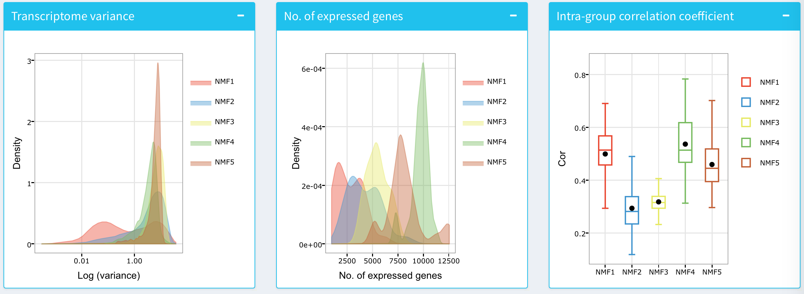

***

# Differential Expression and Enrichment Analysis

Differential expression (DE) analysis between NMF clusters allows for the identification of additional genes differentially expressed in each NMF cluster with statistical analyses calculated via the [DESeq](http://bioconductor.org/packages/release/bioc/html/DESeq.html) algorithm (Love et al., 2014). Expression distributions for DE genes across NMF groups are displayed together with RefSeq annotation. 

## Differential Expression 

## Enrichment Analysis 

[GO Term enrichments](http://bioconductor.org/packages/devel/bioc/html/gage.html) allow for the identification of functional categories enriched in each NMF cluster, which can serve as guidance for further investigation and follow up studies. 

*Note: Make sure to select the correct species. SAKE currently supports `Human` and `Mouse`.*

Summary table and plots for the enrichment analysis. 

User can also click on one of the enriched KEGG pathways they are interested in. [Pathview](https://bioconductor.org/packages/release/bioc/html/pathview.html) will maps and renders pathway grpahs. In this case, we select `TGF-beta signaling pathway` from `NMF Group3`. Red color indicates genes that are upregulated in selected NMF cluster as compared to all the other clusters. 

