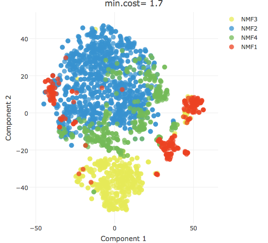

Users can visualize how NMF clusters their data using t-SNE and PCA. Both PCA and t-SNE can be used to reduce high-dimensional gene expression data in two or three dimensions and to help find clusters of similarity in gene expression data. A heatmap tool is also provided to visualize patterns of gene expression across a large numbers of samples. 

## t-SNE

[t-SNE](https://lvdmaaten.github.io/tsne/) is a non-linear form of dimensional reduction that gives each sample a location on a two or three dimensional grid. The user can filter the genes used during t-SNE using four different ranking metrics: mean expression, median expression, MAD, and variance. Like for NMF, we recommend using using Top **1500 - 3000** MAD genes for `bulk RNA-Seq` data; Top **5000 - 8000** MAD genes for `single-cell RNA-Seq` data.  

Under more options, the user can further modify t-SNE:

- **Sample color:** the user can color the sample points either by filename, NMF group assignment, or the level of expression of a specified gene.

- **Perplexity:** perplexity is the number of neighbors used when computing t-SNE for each datapoint. A smaller perplexity will result in tighter clusters, while a higher perplexity will result in more diffuse clusters. 

- **Iterations:** t-SNE will run for a selected number of iterations and choose the optimal dimensional reduction. Generally, we found that the number of iterations did not impact the results of t-SNE.

As mentioned in the earlier section on NMF, concordance of NMF groups and t-SNE clusters indicate the robustness of the results. It's important to use NMF clustering in addition to t-SNE dimensional reduction because NMF can help assign data points to clusters otherwise difficult to group because they are between two distinct but closely connected t-SNE groupings.

Sometimes samples that appear to be grouped into two distinct clusters in t-SNE will be assigned to a single NMF group. This can happen because large differences between clusters can overshadow smaller, but biologically meangingful, differences between subgroups. It's therefore important to cross-reference t-SNE clustering with NMF results, and repeat NMF clustering on NMF groups if there appears to be distinct t-SNE subgroups in a single NMF group to uncover further clusters of samples. In future versions, this iterative process will be automated, and the program will run NMF on NMF clusters that are likely to contain further subgroups. 



In this figure, the NMF1 cluster (red) appears to contain three distinct t-SNE groupings. We ran NMF on the samples from the NMF1 group


When NMF was run on the NMF1 group, it uncovered three distinct subgroup and verified the results from the earlier t-SNE that NMF1 contains three further subclusters. 

## PCA 

Principal component analysis (PCA) is a dimensional reduction technique that finds interrelated variables within data and reduces them into a set of fewer uncorrelated variables that explain the most variance in the data. The principal components are ordered by the amount of variance in the data they explain (e.g. the first principal component explains the most variance in the data). The first two or three principal components can be used to visualize data by plotting data points using the principal components as axes. 


As with t-SNE and NMF, the user has the option to filter the number of genes used to calculate the principal components with four different ranking metrics: mean expression, median expression, MAD, and variance. We recommend using using Top **1500 - 3000** MAD genes for `bulk RNA-Seq` data; Top **5000 - 8000** MAD genes for `single-cell RNA-Seq` data.  

The user can choose which principal components to use as axes to visualize their data. The default is to use the first and second principal components for 2D PCA, and the first, second, and third axes for 3D PCA. 

The user can also designante the size of each sample dot, whether to display its label, the size of the label, and the alpha value (the transparency of each of the dots).

## Heatmap

Heatmaps help with visualizing patterns in gene expression across multiple samples. Each column is a different sample and each row is a different gene. 

There are five options for selecting sets of genes to analyze:

- **Preloaded gene list:** the user can select from preloaded gene lists with gene signatures of various cell types and cell states derived from published literature. 

- **Ranks from data\:** the user can filter a selected number of genes to analyze using four different metrics: median absolute deviation, median expression, mean expression, and variance. 

- **Manually select genes:** the user can genes from a dropdown menu of annotated human or mice genes. 

- **From NMF features:** the user can select genes that are found to be uniquely enriched in a particular NMF group. NMF enriched genes will be highly expressed in their NMF groups and poorly    
                         expressed in the other samples. 
 
- **Upload gene list:** the user can upload their own gene list. 

An example gene list file should look like this:
                  
```{r, echo=FALSE, message=FALSE, warning=FALSE}
library(sake)
data.frame(Gene = head(rownames(Usoskin), n=15))
```        
                     
The first row should be a character string `Gene`. The following rows should be the names/IDs of your gene of interest. 
                
##

Under more options, the user can change the parameters of the heatmap.

- **Column and row colors:** the user can change how the rows and columns are colored. Under column colors, the user can color the sample columns by their filename or by their NMF group.

- **Heatmap color scheme:** the user to pick from several different color schemes used to show highly expressed and poorly expressed genes. 

- **Column clustering:** the user can choose to cluster their samples based on NMF grouping, filenames, the expression of a particular gene, or a hierarchical clustering method. 

- **Distance and Linkage:** hierarchical clustering is used with the heatmap to help determine the relationships and similarities between samples (columns) and genes (rows). Like t-SNE, hierarchical clustering can be beneficial to use with NMF clustering. We provide several different metrics for computing distances and linkages in hierarchical clusters. 


